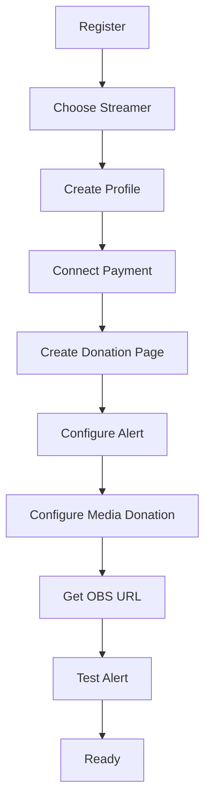
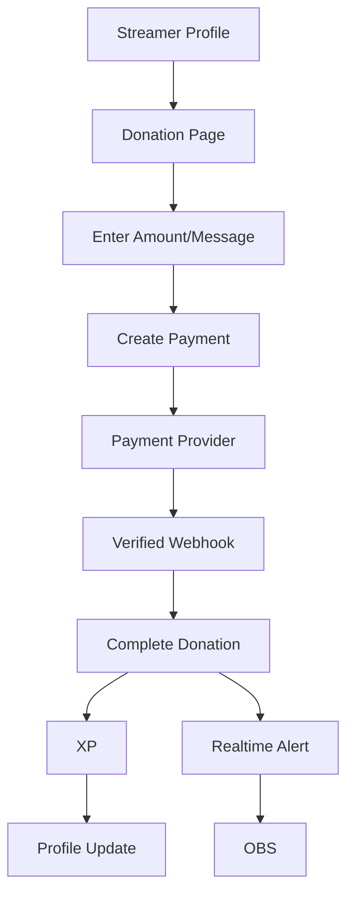
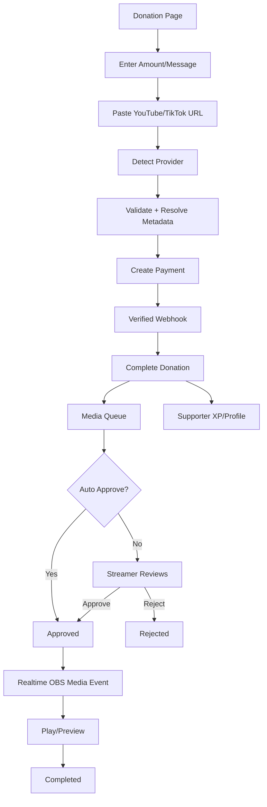

# KOLU — User Flows v0.2

## Streamer onboarding


## Basic donation


## Media donation


## Media rejection

A media item can be rejected without deleting the financial donation record.

```text
Donation = COMPLETED
Media = REJECTED
XP = still valid for completed donation unless product policy explicitly says otherwise
```

The product must define any refund policy separately. Rejected media does not automatically imply a payment refund.

## Failed payment

Payment failure/expiration → donation remains non-completed → no payment-derived XP → no completed-donation alert → no media queue item becomes playable.

## Duplicate webhook

Verify signature → check event/reference → if already processed, return success with no side effects; otherwise process once.

## Privacy

Supporters can control public profile, donation history, supported-streamer list, total support, and anonymous donation behavior.

Media source URLs should not be exposed publicly beyond what is required for the donation/stream interaction.
